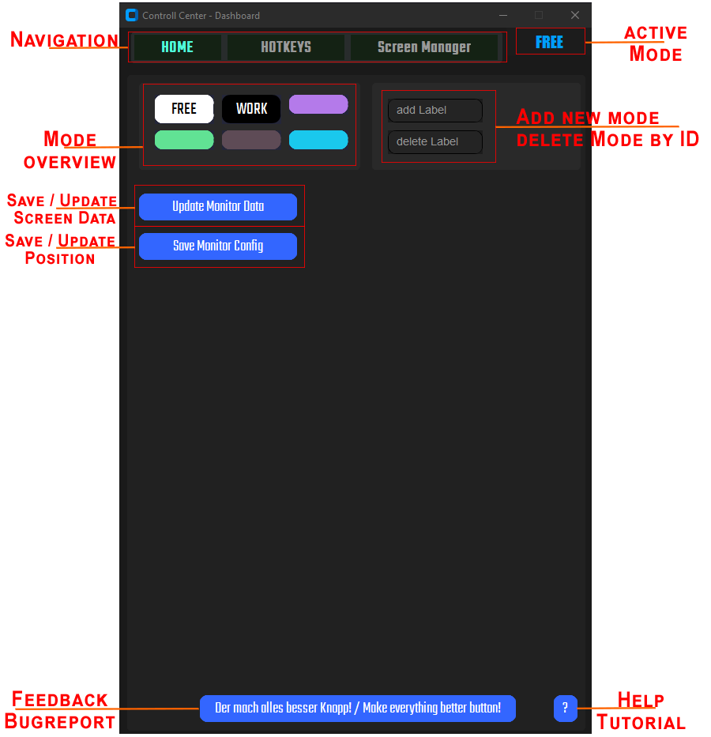

# Starter Guide (Tutorial)

Willkommen zum quick guide für meine kleine Applikation.

Nach dem Willkommens Fenster startest du auf Startseite (Home). Hier findet die allgemeine Verwaltung der verschiedenen Modi, sowie die Zuweisung der Fenster statt.

## Home - Page 1



### Add new Mode

Um einen neuen Modus anzulegen klicke in das `Add Label` Feld und gib dem neuen Modus einen kurzen und pregnaten Namen. z.B. Stream, Shopping, Craft...

Löschen kannst du von dir angelegte Modi durch eingabe des Indexes 0-5

Bestätigen tust du das Anlegen, sowie Löschen durch drücken der "Enter"-Taste

### Update Monitor Data

Zu erst ist es wichtig, dass die App die Höhe und Breite deines Bildschirmes speichert um an diesen Daten deine Fenster korrekt ausrichten zu können. Mit dem drücken des Knopfes werden relevalte Daten gespeichert.

Bei der Verwendung eines neuen Monitores kannst du über diesen Button die Daten jederzeit updaten.

### Save Monitor Config

Dieser Button erfasst die aktuelle Position und Zustände deiner Fenster.
Um deine Configuration der Fenster korrekt speichern zu können, befolge diese 4 Schritte.

**Schritt 1:** Positioniere deine Fenster so, wie du sie haben möchtest. Die größe und Position sind dabei vollkommen frei wählbar.

**Schritt 2:** Wähle nun den Modus aus in dem du deine Configuration speichern möchtest. Den aktuell ausgewählten Modus siehst du oben rechts.

WICHTIG: Ein modus kann immer nur eine Configuration speichern!

**Schritt 3:** Push the Button! um die Configuration zu speichern.

**Schritt 4:** Wechsel nun zurück auf den freien Modus (FREE) und bringe deine Fenster durcheinander. Anschließend wechselst du auf deinen eben konfigurierten Modus. Nun sollten deine Fenster wieder so angeordet sein, wie du es gespeichert hast.

## Hotkeys - Page 2

In der App stehen dir bis zu 20 Hotkeys zur Verfügung. Es gibt die sogannten Mode-Keys, Execute-Keys und Individual-Keys.

### Mode-Keys

Die Mode-keys das sind die ersten 7 Hotkeys, mit denen du statt mit der Benutzeroberfläche auch mit Hotkeys zwischen deinen Modis welchseln kannst. Dies kannst du auch, wenn das Programm minimiert oder gar geschlossen ist.

### Execute-Keys

Nach den ersten 7 Hotkeys gibt es 4 sogenannte Execute-Keys, wie der Name schon sagt sind das Hotkeys die ausschließlich zum starten von Programmen oder öffnen von Datein verwendet werden können.

Hierbei muss du den Pfad und anschleießnd einen Namen für den Hotkey eingeben.

Um programme auszuführen (unter Windows) muss du den Pfad zur `programm.exe` Datei angeben.

```
C:\\programms\photoshop\photoshop.exe
```

Anschließen vergibst du für den Hotkey einen Anzeigenamen.

### Verwendung

Diese ersten 11 Hotkeys verwendets du mit der Tastenkombination `strg`, `ctrl` oder `command` (MacOS) und den Tasten F1-F10. Drücke also `ctrl+F2` für den WORK. Der aktive Modus wird die rehcts oben angezeigt.

### Individual-Keys

Mit dem `+ Button` kannst du bis zu 9 Individual-Keys erstellen. Diese Hotkeys funktionieren nach dem selben prinzip nur mit dem Unterschied, dass du nach dem Namen noch die Tatsenkombination hinzufügen musst. Außerdem können in diesen Hotkeys nicht nur Programm sondern auch Links gespeichert werden.

## Screen Manager

Im Screen Manager findest du eine Liste aller aktiven Fenster deines Systems. Wichtig hierbei ist, es sind nur aktive Benutzer- und keine Systemrelevanten Programme und Fenster aufgeführt. Hier hats du die Möglichkeit bestimmte Fenster manuell einem Modus zuzuordnen. Normalerweise geschieht dieses automatisch oder ganz leicht über den im Home Screen beschrieben Button. Allerdings sind gerade Browserfenster eine wahre Herausforderung, da diese alle gleich heißen und auch keine anderen eindeutigen Identifikationsmöglichkeiten bieten.

Daher hast du hier die Möglichkeit, ein wenig nachzubessern, sollte ein Browserfenster der Meinung sein sich etwas anders zu verhalten als gewollt.

## Tipp

In Goolge Chrome und dem Edge Browser kann man ein komplettes Browserfender mit einem Namen versehen. Dies erleichtert der App die Wiedererkennung des Fensters und es sollte zu weniger Problemen mit verlorenen Browserfenstern kommen

Opera hingegen bietet die Möglichkeit sogannte Arbeitsbereiche / Workspaces einzurichten wimit man verschiedene browserfenster innerhalb eines Fensters verwalten kann.

Browser sind zickig und auch wenn wir bereits das Jahr 2025 schreiben, so sind Browser was diesen teil der technik angeht leciher immernoch in den 90ern.

Die App verwendet zwar einen relativ guten Trackingmeachnismus um mit einer recht genauen Wahrscheinlichkeit ein Browserfenster vom `Mode: Work` von einem Browserfenster vom `Mode: Stream` zu unterscheiden, aber hin und wieder schlägt der Versuch den nicht vorhanden Unterschied zu erkennen auch mal fehl.
